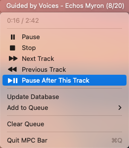

# MPC Bar
A Mac menu bar client for the [Music Player Daemon](https://www.musicpd.org).

## Installation
If you have [Homebrew](https://brew.sh), you can simply run these
commands to install and launch MPC Bar:

```
brew install spnw/formulae/mpc-bar
brew services start spnw/formulae/mpc-bar
```

## Configuration
MPC Bar is configured with a `~/.mpc-bar.ini` file.  Below are the
default options.  Note that `format` works just like `mpc -f`; see the
[mpc(1)](https://man.archlinux.org/man/mpc.1#f,) man page for more
information.  Lines that are commented out in the example do not have
any default.

```
[connection]
host = localhost
port = 6600
# password = qwerty123

[display]
format = [%name%: &[[%artist%|%performer%|%composer%|%albumartist%] - ]%title%]|%name%|[[%artist%|%performer%|%composer%|%albumartist%] - ]%title%|%file%
idle_message = No song playing
show_queue = true                       # Show queue/position info while playing? (true/false)
show_queue_idle = (value of show_queue) # Show queue/position info while idle? (true/false)
# lua_filter = ~/.mpc-bar-filter.lua    # Path to a Lua filter script
```

## Lua filter
Sometimes, especially with Internet radio, your MPD status can end up
a lot longer than it needs to be.  MPC Bar lets you write a filter
script in Lua to massage the status into a more manageable form.
Here's an example:

```lua
local subs =
  {
    {"^Groove Salad: a nicely chilled plate of ambient beats and grooves.", "[Groove Salad]"},
    {"^Drone Zone: Atmospheric ambient space music. Serve Best Chilled. Safe with most medications.", "[Drone Zone]"},
    {" %[SomaFM%]:", ""},
  }

function filter(s)
  for _, sub in ipairs(subs) do
    s = s:gsub(sub[1], sub[2])
  end
  return s
end
```

MPC Bar expects a global function called `filter`, which takes the
original MPD status and returns a new status to be used instead.

Currently there is no provision for error reporting.  If your code has
an error, MPC Bar will just use the original status.  You might want
to test on your own with the standalone `lua` interpreter.
